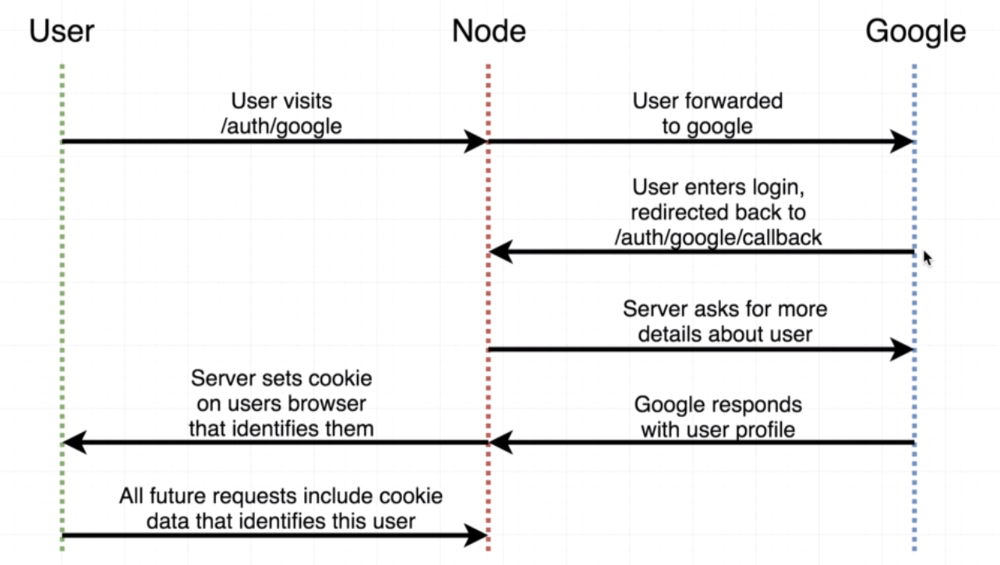
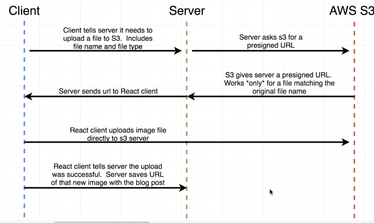

[](https://travis-ci.com/johnnyzh82/AdvancedNodeStarter)

Some course notes after taking Udemy Node JS: Advanced Concept course

# OAuth flow


# Test
puppeteer   (Starts up chromium)
-> Browser  (Represents an open browser window)
-> Page     (Represents one individual tab)

### 88. Session Signatures
Session signature is make sure the session is not temper by malicious users

Base64 session + Cookie Signing key = Session signature  (Generate Session signature)

Once session came into our application, we can reverse the equation

Base64 session = Cookie Signing key + Session signature  (Verify session)

For example:
```javascript
> const session = 'eyJwYXNzcG9ydCI6eyJ1c2VyIjoiNjA3MjYwM2I4YzJhNWExZWM4NzEyZTkwIn19'
undefined
> const Keygrip = require('keygrip')
undefined
> const keygrip = new Keygrip(['123123123'])
undefined
> keygrip.sign('session='+session)
'MiX15ZbdmBNZUAhg9Sc7dw-BuC8'
> keygrip.verify('session='+session, 'MiX15ZbdmBNZUAhg9Sc7dw-BuC8')
true
> keygrip.verify('session='+session, 'MiX15ZbdmBNZUAhg9Sc7dw-BuC8x')
false
```

### 98-99 Adding a login method
The trivial approach:
Require puppeteer Page class and extend class by using `Page.prototype.login`.

A better way using ES6 proxy:
```javascript
const allGreeting = new Proxy(moreGreeting, {
    get: function(target, property) {
        return target[property] || greetings[property];
    }
})
```

### 129 Client Builds
`npm install -prefix client` can help install sub-module independently in child directory

### 145 Upload Flow with AWS S3
1. Client mostly talks to AWS S3 directly to reduce server bandwidth and computation
2. Server only process the url and store url to mongo db

